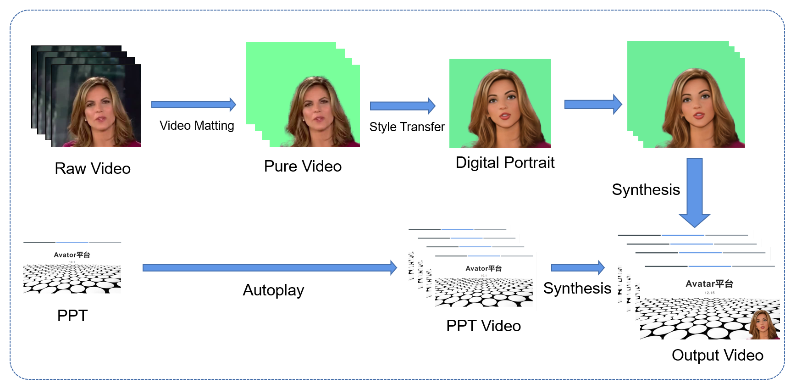
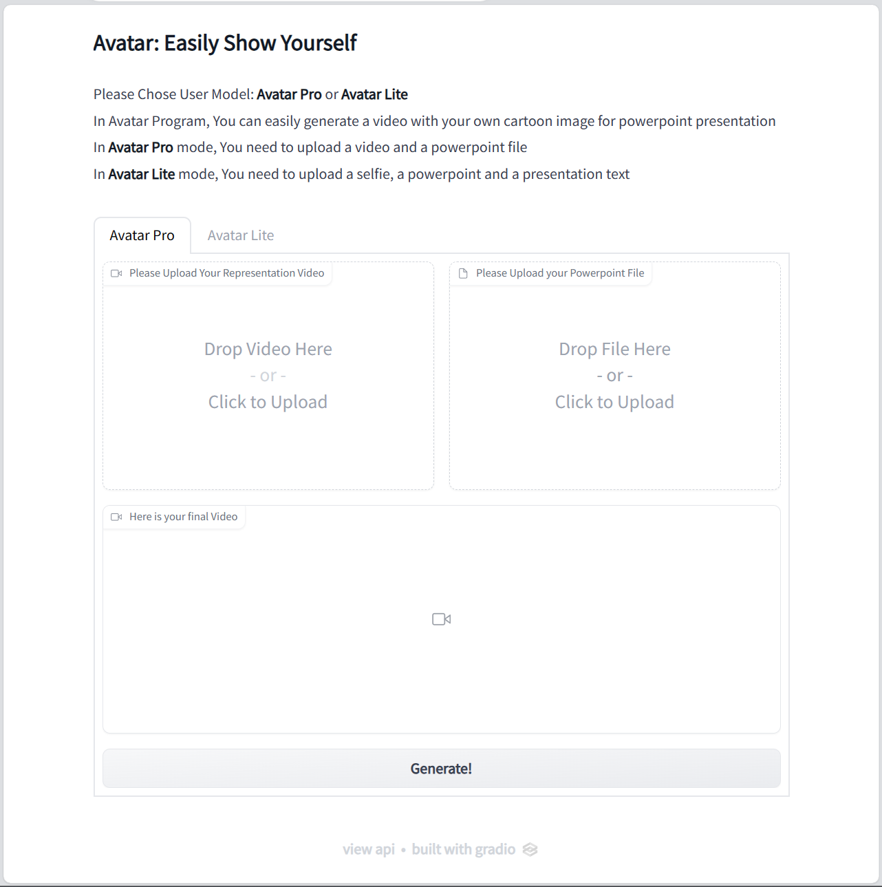

## Avatar——Easily show yourself

Avatar is an easy-to-use system which can transfer your presentation video to a digital portrait with the input PPT and synthesis the final presentation video based on Gradio Framework.

<video src="./image/demo.mp4" controls title="Title"></video>

The illustration of Avatar as followed:



The Avatar System contains two mode, Pro and Lite, Currently, only Pro mode is supported, the Lite model is comming soon.

The UI of Avatar System are shown as follows:



### Installation

**Clone this repo:**

```bash
git clone https://github.com/ZZDoog/Avatar.git
cd VToonify
```

**Dependencies:**

It's worth noting that due to the Avatar system's reliance on the pywin32 library for converting PPT files to video, our development environment has only been tested on Windows systems, and we have not conducted tests on Linux so far.

We have tested on:

- CUDA 11.6
- PyTorch 1.13.0
- Pillow 8.3.1; Matplotlib 3.3.4; opencv-python 4.5.3; Faiss 1.7.1; tqdm 4.61.2; Ninja 1.10.2; pywin32 305; av 8.0.3; pim 0.5

All dependencies for defining the environment are provided in 
We recommend running this repository using [Anaconda](https://docs.anaconda.com/anaconda/install/) to install PyTorch that matches your own CUDA version following [https://pytorch.org/](https://pytorch.org/)):

```
pip install -r requirements.txt
```

### Usage

After installing all the dependency, run

```
python app.py
```

and then you can run Avatar locally on your device.

You can adjust the inference batch_size to find a appropriate setting for your local GPUs.

Acknowledgments

The code is mainly developed based on [VToonify](https://github.com/williamyang1991/VToonify) ,  [RobustVideoMatting](https://github.com/PeterL1n/RobustVideoMatting) and [pywin32](https://github.com/mhammond/pywin32).

If any question occurs when you employ this repo feel free to commit an issue or gather information from the issues of mentioned above in the repos.
